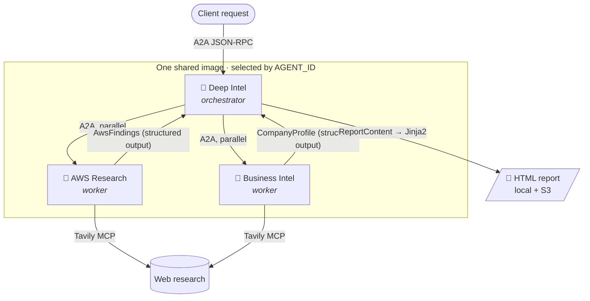
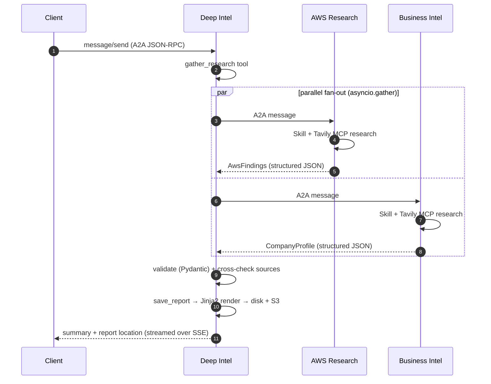

<div align="center">

# 🔍 AWS Customer Intelligence Orchestrator

**Multi-agent research system that turns a company domain into an AWS sales-opportunity report.**

[](https://www.python.org/)
[](https://strandsagents.com)
[](https://a2a-protocol.org)
[](https://aws.amazon.com/bedrock/agentcore/)
[](https://docs.docker.com/compose/)

*Three specialized agents · one shared container image · agent-to-agent over HTTP*

</div>

---

## 📖 Overview

Give it a prompt like `"Analyze atscale.com for AWS opportunities"` and it produces a polished HTML customer-intelligence report — executive summary, company snapshot, AWS opportunities mapped to business challenges, and strategic recommendations — saved locally and optionally uploaded to S3.

Under the hood, a **Deep Intel** orchestrator fans out to two specialist research agents **in parallel** over the [A2A protocol](https://a2a-protocol.org), validates their findings against typed contracts, and renders the report deterministically from a template. Every agent runs on [Amazon Bedrock](https://aws.amazon.com/bedrock/) and is served with [`bedrock-agentcore`](https://pypi.org/project/bedrock-agentcore/)'s A2A runtime — the same binary runs locally under Docker Compose or in the cloud as AgentCore Runtimes.



## ✨ Key Features

- **🐳 One image, three agents** — every container runs the same code; the `AGENT_ID` env var (`deep_intel` | `aws_research` | `business_intel`) decides which agent a process becomes at boot.
- **🔗 A2A-native** — each agent is an independent [A2A](https://a2a-protocol.org) service with an agent card, served via `bedrock_agentcore.runtime.serve_a2a` (AgentCore contract: port 9000 at `/`, `/ping` health, card at `/.well-known/agent-card.json`).
- **⚡ Guaranteed parallelism** — the orchestrator fans out to both workers with `asyncio.gather` inside a single tool, not by hoping the model emits concurrent tool calls.
- **🧾 Schema-enforced output** — workers produce their typed contracts (`AwsFindings`, `CompanyProfile`) via Strands **structured output**: enforced by the provider at decode time, never parsed out of prose.
- **🖨️ Deterministic HTML** — the LLM composes only typed `ReportContent`; a Jinja2 template owns all markup/CSS. Reports are always valid, consistent, and injection-safe (autoescaped).
- **📡 Streaming where it matters** — the orchestrator streams its response over A2A SSE; workers return a single structured-JSON artifact by design.
- **🗂️ Registry-driven capability** — every agent's skills, output schema, discovery env vars, and MCP servers are declared in one place (`agents/registry.py`). Adding a capability is a data change, not a new service class.
- **📚 Skills as Markdown** — research methodology lives in `agents/skills/*/SKILL.md`, loaded on demand via progressive disclosure. Edit worker behavior without touching Python.
- **☁️ IaC included** — CDK stacks deploy the three agents as AgentCore Runtimes with per-agent IAM roles and worker-ARN injection.

## 🚀 Quick Start

### Prerequisites

- Python **3.10+** (containers use 3.12) and [`uv`](https://docs.astral.sh/uv/)
- AWS credentials with **Bedrock** access
- A **Tavily MCP** endpoint URL (web research for the workers)

### Installation

```bash
git clone <this-repo> && cd jarvis-strands-github-mcp
uv sync
```

### Configuration

Create a `.env` file:

```bash
# Web research (required — workers call Tavily via MCP)
TAVILY_MCP_URL=https://your-tavily-mcp-endpoint
TAVILY_MCP_TOKEN=your_token            # optional, if the endpoint needs auth

# Bedrock model (required — no default). If your org gates Bedrock behind
# application inference profiles, use the profile ARN here.
MODEL=us.anthropic.claude-sonnet-5

# AWS credentials (or use a profile / instance role)
AWS_ACCESS_KEY_ID=...
AWS_SECRET_ACCESS_KEY=...
AWS_REGION=us-east-1

# Reporting (optional)
S3_BUCKET=your-reports-bucket
```

<details>
<summary><b>📋 Full environment variable reference</b></summary>

| Variable | Required | Default | Description |
|----------|:--------:|---------|-------------|
| `AGENT_ID` | ✅ | — | Agent this process serves: `deep_intel` \| `aws_research` \| `business_intel` |
| `TAVILY_MCP_URL` | ✅ | — | Tavily MCP server URL |
| `MODEL` | ✅ | — | Bedrock model id, inference-profile ARN, or application-inference-profile ARN |
| `TAVILY_MCP_TOKEN` | ❌ | — | Auth token for the Tavily MCP endpoint |
| `TAVILY_MCP_AUTH_HEADER` | ❌ | `Authorization` | Header name for the MCP token |
| `TAVILY_MCP_AUTH_PREFIX` | ❌ | `Bearer ` | Prefix prepended to the MCP token |
| `TAVILY_MCP_TRANSPORT` | ❌ | `streamable_http` | MCP transport |
| `AWS_REGION` | ❌ | `us-east-1` | AWS region for Bedrock / S3 |
| `MAX_TOKENS` | ❌ | `8192` | Max tokens per model call |
| `BEDROCK_READ_TIMEOUT` | ❌ | `300` | Bedrock read timeout (s) |
| `BEDROCK_CONNECT_TIMEOUT` | ❌ | `30` | Bedrock connect timeout (s) |
| `BEDROCK_MAX_ATTEMPTS` | ❌ | `3` | Bedrock retry attempts |
| `REPORT_OUTPUT_DIR` | ❌ | `reports` | Local output directory |
| `S3_BUCKET` | ❌ | — | Enables S3 upload when set |
| `S3_PREFIX` | ❌ | `aws-intel-reports` | S3 key prefix |
| `ORCHESTRATOR_LOG_LEVEL` | ❌ | `INFO` | `DEBUG` surfaces tool inputs/results |
| `ORCHESTRATOR_LOG_FILE` | ❌ | `orchestrator.log` | Log file path |
| `PORT` | ❌ | `9000` | Local port override |
| `AGENT_BASE_URL` | ⚠️ | `http://localhost:<PORT>` | URL **other agents** use to reach this one — advertised in the agent card. Set per-service (compose does this); never set globally |
| `DEEP_INTEL_URL` / `AWS_RESEARCH_URL` / `BUSINESS_INTEL_URL` | ❌ | — | Explicit peer URLs (local/docker discovery, highest precedence) |
| `REGISTRY_URL` | ❌ | — | Jarvis registry base URL; peers resolve to `{REGISTRY_URL}/api/v1/proxy/a2a/{path}` (deployed discovery) |
| `<AGENT_ID>_REGISTRY_PATH` | ❌ | agent id | Registry path slug override per agent (e.g. `AWS_RESEARCH_REGISTRY_PATH`) |
| `AWS_RESEARCH_AGENT_ARN` / `BUSINESS_INTEL_AGENT_ARN` | ❌ | — | AgentCore runtime ARNs (direct-call fallback when no registry) |
| `A2A_BEARER_TOKEN` | ❌ | — | Static bearer token for outbound A2A calls (highest auth precedence) |
| `A2A_TOKEN_SECRET_ARN` | ❌ | — | Secrets Manager secret (per agent, e.g. `agentcore/deep_intel`) holding the Entra ID token (raw or `{"token": ...}`), TTL-cached ~5 min |

</details>

### Run all three agents

```bash
docker compose up --build
```

| Service | Host port | `AGENT_ID` |
|---------|-----------|------------|
| Deep Intel (orchestrator) | `9001` | `deep_intel` |
| AWS Research | `9002` | `aws_research` |
| Business Intel | `9003` | `business_intel` |

### Send a request

Any A2A/JSON-RPC client works — no SDK required:

```bash
curl -s -X POST http://localhost:9001/ \
  -H "Content-Type: application/json" \
  -d '{
    "jsonrpc": "2.0",
    "id": "1",
    "method": "message/send",
    "params": {
      "message": {
        "kind": "message",
        "messageId": "'"$(uuidgen)"'",
        "role": "user",
        "parts": [{"kind": "text", "text": "Analyze stripe.com for AWS opportunities"}]
      }
    }
  }'
```

The response is a brief findings summary with the report location; the full HTML lands in `reports/<Company>_<timestamp>.html` (and S3 when configured).

<details>
<summary><b>Run a single agent without Docker</b></summary>

```bash
AGENT_ID=aws_research PORT=9002 uv run python -m agents.server
```

Health: `GET /ping` · Agent card: `GET /.well-known/agent-card.json`

</details>

## 🏗️ How It Works



1. **Deep Intel** receives the prompt and calls its `gather_research` tool, which fans out to both workers in parallel and validates each response against its Pydantic contract.
2. **Workers** research using the Tavily MCP tools, guided by their Skill; their final answer is produced via structured output, so the returned artifact is schema-valid JSON *by construction*.
3. **Deep Intel** cross-checks the sources, composes typed `ReportContent` (content only — no markup), and its `save_report` tool renders the HTML through the Jinja2 template and persists it.

### Design decisions worth knowing

- **A2A clients send messages to `card.url`**, not to the endpoint you configure (that's only used to fetch the card). Each agent therefore advertises the address *peers* can reach it at (`AGENT_BASE_URL`; AgentCore overwrites it with the real runtime URL when deployed).
- **Workers don't stream.** In A2A-compliant streaming mode, mid-loop narration would stream into the artifact and displace the final structured JSON — so workers use single-artifact mode, while the orchestrator streams to the client.
- **Per-conversation isolation.** `StrandsA2AExecutor` builds a fresh agent per A2A `context_id` (LRU-cached); the expensive Tavily MCP client is started once per process and shared.

## 📂 Project Structure

<details>
<summary><b>Expand</b></summary>

```
Dockerfile                       # Single image for all agents
docker-compose.yml               # Three agent services (host ports 9001-9003)
agents/
├── server.py                    # Entrypoint: AGENT_ID → registry spec → serve_a2a (port 9000)
├── registry.py                  # ⭐ Source of truth: agent specs, schemas, skills, MCP servers, discovery
├── a2a_client.py                # Thin A2A client for parallel worker calls (+ bearer passthrough)
├── deep_intel/
│   ├── orchestrator.py          # Orchestrator agent: gather_research + save_report tools
│   └── reporting.py             # Jinja2 rendering, disk storage, optional S3 upload
├── skills/                      # Worker methodologies (progressive-disclosure Skills)
│   ├── aws-opportunity-research/SKILL.md
│   └── company-intelligence/SKILL.md
└── shared/
    ├── research_agent.py        # Unified worker engine (skill + schema + role line)
    ├── schemas.py               # Typed contracts: AwsFindings, CompanyProfile, ReportContent
    ├── bedrock.py               # BedrockModel + timeout/retry construction
    ├── templates/report.html.j2 # Report layout/CSS (the LLM never writes markup)
    ├── mcp/                     # MCP client builders (Tavily via streamable HTTP)
    └── core/                    # Config (fail-fast), logging, exceptions
cdk/                             # AgentCore Runtime deployment (see cdk/README.md)
test/                            # Contract + renderer + tool-path tests
reports/                         # Generated HTML reports (bind-mounted)
```

</details>

## ☁️ Deployment (Amazon Bedrock AgentCore)

The [`cdk/`](cdk/) app deploys the three agents as **AgentCore Runtimes** on the A2A protocol — one shared ECR image, one runtime per `AGENT_ID`:

```bash
cdk deploy JarvisAgentsBase        # ECR repo + reports S3 bucket
# CI pushes the image (.github/workflows/ci-ecr.yml)
cdk deploy JarvisAgentsRuntime -c imageTag=<git-sha> -c model=<model-or-profile-arn> -c tavilyMcpUrl=<url>
```

Workers deploy first; their runtime ARNs are injected into Deep Intel's environment and granted `bedrock-agentcore:InvokeAgentRuntime`. Rolling out new code is decoupled from CDK: CI pushes a new image, then `update-agent-runtime` (the ECS *force-new-deployment* analog). Inbound auth supports a **custom JWT authorizer** (e.g. Microsoft Entra) via CDK context, falling back to IAM SigV4. See [`cdk/README.md`](cdk/README.md).

## 🧪 Testing

```bash
uv run pytest
```

Covers the worker→orchestrator typed contract (`_coerce`), the report renderer (valid HTML, autoescaping, optional sections), and `save_report` through the real Strands tool-invocation path.

## 🗺️ Roadmap

- [x] **Registry-based discovery & invocation** — deployed inter-agent calls route through the Jarvis registry A2A proxy (`REGISTRY_URL`), replacing hard-coded runtime ARNs
- [x] **Inter-agent auth for deployed runtimes** — static Entra ID token from env/Secrets Manager (`agents/shared/auth.py`), with caller-JWT passthrough as fallback
- [ ] **Machine OAuth (client-credentials)** — replace the manually-rotated static token
- [ ] **Secrets hygiene** — move `TAVILY_MCP_TOKEN` to AWS Secrets Manager
- [ ] **Tool-error observability** — WARNING-level hook for failed tool calls
- [ ] **Persistent task store** — tasks are in-memory today and don't survive restarts

## 🙌 Acknowledgments

Built on the [Strands Agents SDK](https://strandsagents.com), the [A2A protocol](https://a2a-protocol.org), [Amazon Bedrock AgentCore](https://aws.amazon.com/bedrock/agentcore/), and [Tavily](https://tavily.com) web research via [MCP](https://modelcontextprotocol.io).

## 📜 License

License to be determined.
